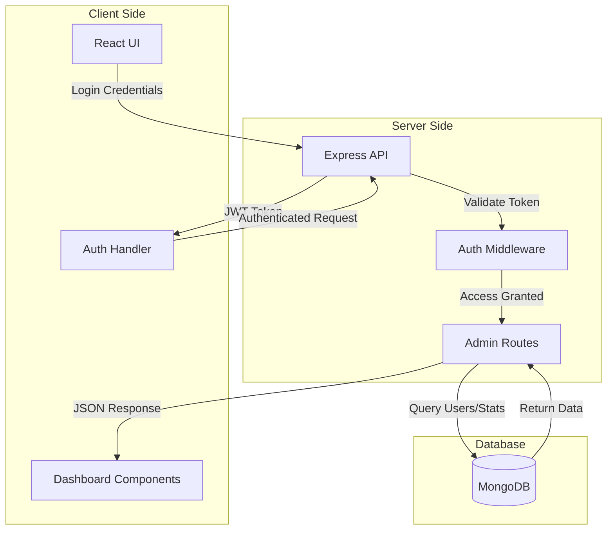

# Project Policy Dashboard

A comprehensive administrative dashboard built with the MERN stack (MongoDB, Express, React, Node.js). This application is designed to manage users, subscriptions, payments, and feedback for a service platform.

## 🚀 Tech Stack

### Frontend
- **Framework:** [React 19](https://react.dev/)
- **Build Tool:** [Vite](https://vitejs.dev/)
- **Styling:** [Tailwind CSS](https://tailwindcss.com/)
- **Routing:** [React Router v7](https://reactrouter.com/)
- **HTTP Client:** [Axios](https://axios-http.com/)
- **Visualization:** [Recharts](https://recharts.org/)
- **Icons:** [Lucide React](https://lucide.dev/)

### Backend
- **Runtime:** [Node.js](https://nodejs.org/)
- **Framework:** [Express 5](https://expressjs.com/)
- **Database:** [MongoDB](https://www.mongodb.com/) (via Mongoose 9)
- **Authentication:** JWT (JSON Web Tokens)
- **Security:** Bcryptjs, CORS

## 📊 Architecture Flow



## ✨ Features

- **Admin Authentication:** Secure login system for administrators.
- **Protected Routes:** Dashboard access is restricted to authenticated admin users.
- **Dashboard Analytics:** Visual statistics for:
  - Total Users
  - Revenue
  - Feedback Ratings
- **User Management:** Track user verification status, Google Auth integration, and subscription details.
- **Payment Monitoring:** (Backend support implied)
- **Feedback System:** (Backend support implied)

## 🛠️ Installation & Setup

### Prerequisites
- Node.js (v18+ recommended)
- MongoDB (Local or Atlas URI)

### 1. Clone the Repository
```bash
git clone <repository-url>
cd project_policy_dashboard
```

### 2. Backend Setup
Navigate to the backend directory, install dependencies, and start the server.

```bash
cd backend
npm install

# Create a .env file in the backend directory
# Add your MongoDB connection string and secrets
# PORT=3560
# MONGO_URI=your_mongodb_connection_string
# JWT_SECRET=your_jwt_secret

npm start
```
*The backend server will start on port `3560` by default.*

### 3. Frontend Setup
Open a new terminal, navigate to the root directory (or `project_policy_dashboard` if you are not already there), and install frontend dependencies.

```bash
# From the root project directory
npm install
npm run dev
```
*The frontend will start, typically on `http://localhost:5173`.*

## 📂 Project Structure

```
project_policy_dashboard/
├── backend/                # Express Server
│   ├── models/             # Mongoose Schemas (User, Admin, Payment, Feedback)
│   ├── routes/             # API Routes (auth, admin)
│   ├── middleware/         # Auth middleware
│   ├── db.js               # Database connection logic
│   └── index.js            # Server entry point
├── src/                    # React Frontend
│   ├── components/         # Reusable UI components (Sidebar, StatsCard, etc.)
│   ├── pages/              # Main Page Views (Login, Dashboard)
│   ├── App.jsx             # Main Application Component & Routing
│   └── main.jsx            # React Entry Point
├── .gitignore
├── package.json            # Frontend Dependencies
└── README.md               # Project Documentation
```

## 🔗 API Endpoints

| Method | Endpoint | Description |
| :--- | :--- | :--- |
| **POST** | `/api/auth/login` | Admin login |
| **POST** | `/api/auth/create-admin` | Create new admin (Protected) |
| **GET** | `/api/admin/stats` | Get dashboard statistics |
| **GET** | `/api/admin/users` | List all users |
| **GET** | `/api/admin/payments` | List payments |
| **GET** | `/api/admin/feedbacks` | List feedbacks |

## 🤝 Contributing

1. Fork the repository.
2. Create a new branch (`git checkout -b feature/YourFeature`).
3. Commit your changes (`git commit -m 'Add some feature'`).
4. Push to the branch (`git push origin feature/YourFeature`).
5. Open a Pull Request.